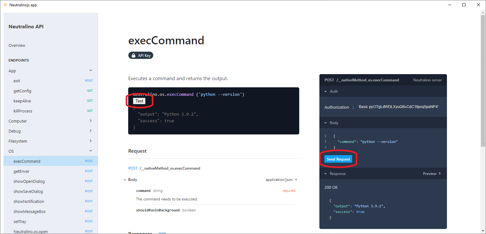
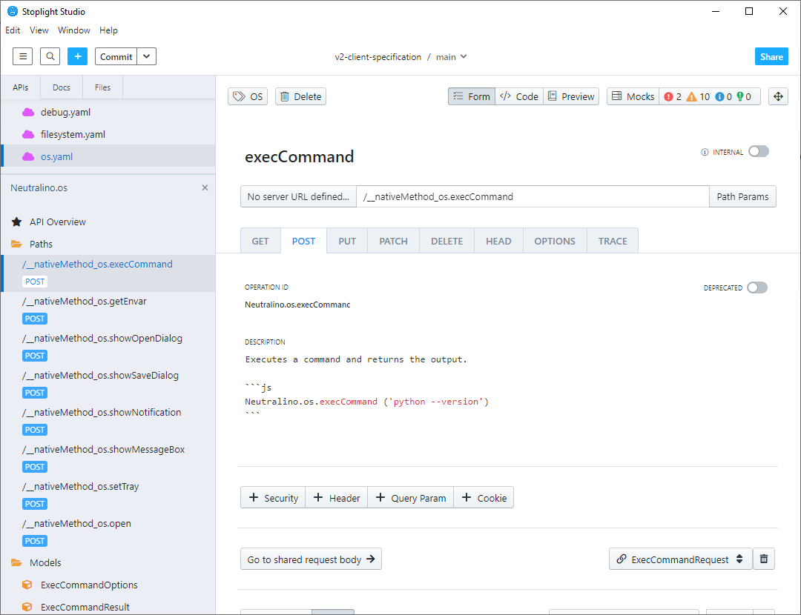

# neutralino-monorepo

## To manually test the server with an interface:

- `make app`

  This creates a standard Neutralino application \
  (You must have the neutralinojs repository in the parent of it).

- `neu run`
  
  Displays `client/test/index.html`. 

  There are two ways to test the server, with the client API or by sending messages directly.

  

## Modify API 

- `make spec-watch`

  to automatically build the `spec/dist/neutralino.api.json` file based on the `spec/api/*.yaml` definitions

- edit YAML files

  since `neu run` launches Neutralino in debug mode, it is therefore possible to run this command to have a direct update of the modifications.

  An easy way to change the definitions is to use Stoplight studio:
  
  

  > Note: In these cases, it may take a few seconds to update the changes directly.

