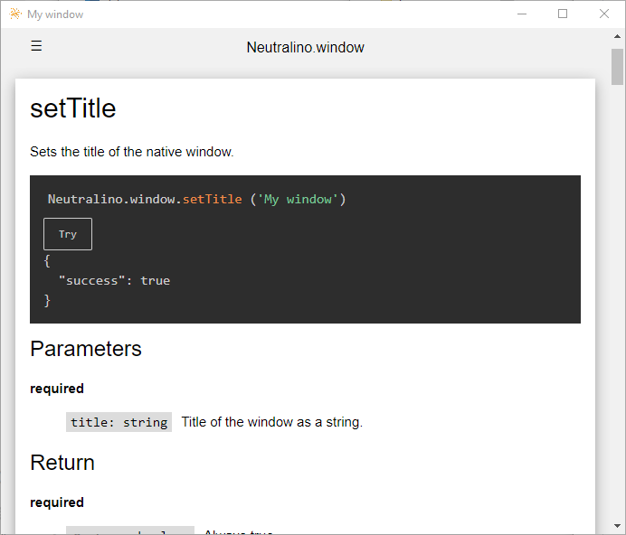

# Neutralino devtools

Various tools to make Neutralino API dependencies consistent.

From a single definition, it is possible to generate:

- Markdown files for the site
- Typescript definition of server messages
- Schema of `neutralino.config.json`
- Test application

  

**NOTE** 

These script can use:
- wildcards `*` in path patterns
- sequential commands with `&&`
- parallel commands with `&`

If like me you don't have a LINUX compatible terminal, a simple way is to use [Git bash](https://git-scm.com/downloads).

To facilitate the operation you must have Gnu Make on your system.
If you are on Windows, you can install this [complete package, except sources](http://gnuwin32.sourceforge.net/packages/make.htm)

## The quick way

```bash
git clone https://github.com/corbane/neutralino-monorepo.git
cd neutralino-monorepo
make quickway
```
## Command overview

command | overview
--- | ---
[`api.ts.wip`](#apitswip) | Compile the js client library
[`git.clone`](#gitclone) | Initialize Git submodules
[`js.install`](#jsinstall) | Initialize Node packages
[`napi.dts`](#napidts) | Generate a Typescript definition file from API files.
[`napi.html`](#napihtml) | Generate a HTML file from a Markdown file.
[`napi.md`](#napimd) | Generate a Markdown file from a NAPI file.
[`napi.sch`](#napisch) | Generate a JSON Schema File from a NAPI File.
[`readme`](#readme) | Generate this `README.md`
[`start.site`](#startsite) | 
[`test.app`](#testapp) | 

## `api.ts.wip`

Compile the js client library

**WORK IN PROCESS**


**ARGS**

* `[flags...]`

**TODO**

- `neutralino.js.map` is not generated in dev mode.
- Add a function to move the .js.map files while keeping the references to the sources.


[<sub>top</sub>](#command-overview)

## `git.clone`

Initialize Git submodules

**ARGS**

* No args

**DETAILS**

Run the `git clone` command to download the Neutralino repositories in the following directories.

- `neutralinojs` in `server`
- `neutralino.js` in `client`
- `neutralinojs.github.io` in `site`


[<sub>top</sub>](#command-overview)

## `js.install`

Initialize Node packages

**USAGE**

* `[packages_manager = --npm]` Can be oneof `--npm`, `--yarn` or `--pnpm`
* `[flags...]`                 Flags are passed to the package manager and depend on which one you choose.


[<sub>top</sub>](#command-overview)

## `napi.dts`

Generate a Typescript definition file from API files.

**ARGS**

- `--napis   <file...>` Input NAPIs in JSON or YAML format.
- `--outfile <file>`    TypeScript definition output file.
- `--watch`

**DETAILS**

This command is used to create the `neutralino.messages.d.ts`
file to add type checking to the client API's `request` function.


[<sub>top</sub>](#command-overview)

## `napi.html`

Generate a HTML file from a Markdown file.


[<sub>top</sub>](#command-overview)

## `napi.md`

Generate a Markdown file from a NAPI file.

**ARGS**

- `--napis  <file...>`  Input NAPIs in JSON or YAML format.
- `--outdir <dir>`      Output directory.
- `--watch`

**DETAILS**

This command is used to create the Markdown source files.
- https://neutralino.js.org/docs/configuration/neutralino.config.md
- https://neutralino.js.org/docs/api/*.md

**Note:** The output file name is different than the existing.
- currently: `neutralino.config.json.md`
- output: `neutralino.config.schema.md`


[<sub>top</sub>](#command-overview)

## `napi.sch`

Generate a JSON Schema File from a NAPI File.

**ARGS**

- `--napis  <file...>` Input NAPIs in JSON or YAML format.
- `--outdir <path>`    Output directory.
- `--watch`

**DETAILS**

This command is used to create the `neutralino.config.schema.json` file.

This allows you to have a completion when editing the `neutralino.config.json` file.
Only if the IDE supports this feature and if `neutralino.config.json` has a `$schema` field like:

```json
{
    "$schema"         : "<DIR>/neutralino.config.schema.json",
    "applicationId"   : "js.neutralino.sample",
    ...
}
```

The actual value of `<DIR>` must be defined, the schema can be, for example:
- served by the site like `https://neutralino.js.org/v2/neutralino.config.schema.json`
- or included in the resource directory `./resources/neutralino.config.schema.json`


[<sub>top</sub>](#command-overview)

## `readme`

Generate this `README.md`

**ARGS**

* `--cmddir  <path>`
* `--intro   <file>`
* `--outfile <file>`
* `[--watch]`


[<sub>top</sub>](#command-overview)

## `start.site`

**WORK IN PROCESS**


[<sub>top</sub>](#command-overview)

## `test.app`

**WORK IN PROGRESS**


[<sub>top</sub>](#command-overview)

